# Build Instructions and Notes

### Operating Principles

Liquid exfoliation processes, and many other mixing/formulation operations, impart high shear rates ($\dot{\gamma}$) on precursor materials dispersed in solvents. This action can generate heat through viscous heating of the fluid ($\dot{Q}$). A schematic of a liquid exfoliation process that uses a rapidly rotating impeller inside a closed vessel is shown in the schematic below. When the vessel is allowed to cool naturally in air, the amount of heat that can be dissipated from the system is limited by passive heat transfer modes (natural convection & radiation) from the external surface of the vessel to the ambient surroundings ($Q_{nc}''$). This can result in uncontrollably high product temperatures that can affect the mixing process and/or impact the reliability of the exfoliation system itself.

The aim of this build is to provide a low cost approach that can cool a kitchen blender vessel during the liquid exfoliation of nanomaterials. The operating principle is illustrated on the right schematic below. A cooling jacket surrounds the process vessel. The space inside is filled with ice cubes and chilled water which removes thermal energy from the process vessel using two heat transfer modes: the latent heat of fusion from a phase change of ice ($Q_{pc}''$) and the sensible heating of liquid water that is enhanced by coolant recirculation ($Q_{cv}''$).

This build can be combined with the following repositories to create a standalone, low cost scientific apparatus with speed and product temperature control: 

1. [Thermocouple-Datalogger](https://github.com/stafforj/Thermocouple-Datalogger) repository for temperature data aquisition module.
2. [PID-blender](https://github.com/DTP587/PID-Blender) repository for finely tuned blender speed control, or
3. [Automated-Relay-Switch](https://github.com/stafforj/Automated-Relay-Switch) repository for basic blender control.

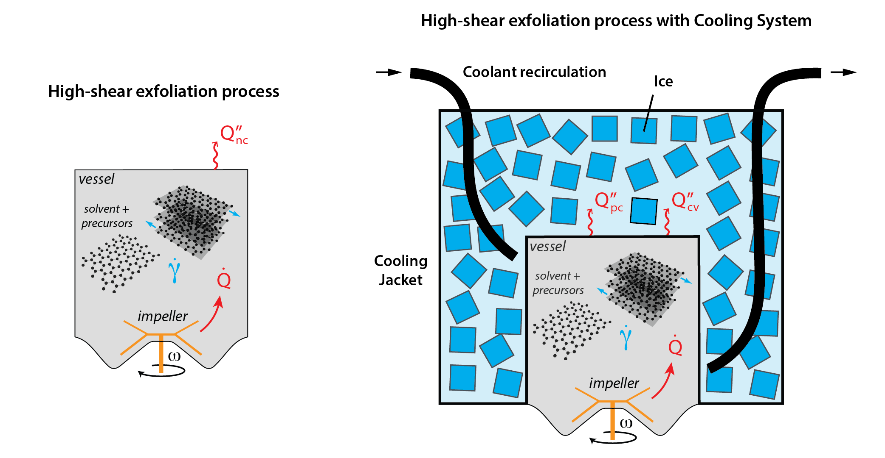

## Thermal Design

The hardware design is based on the thermal loads that need to be dissipated from the liquid exfoliation system. For this build we use a 350W Kenwood BLP31.D0WG blender. We typically operate the process for $t ≈ 15$ mins to perform a synthesis (doi:ACS). Next we can estimate the amount of ice that would be melted into liquid water using the latent heat of fusion.

```
Heat load: 350 W = 350 J/s = 21 kJ/min
Latent heat of fusion = 334 kJ/kg

21kJ/min / 334kJ/kg = 0.063 kg/min
1260kJ/h / 334kJ/kg = 3.77 kg/h
```
Which is ≈ 1 kg of ice melted in 15 mins. This is a basic starting point for sizing the cooling jacket. For this application, at a minimum the design must be capable of holding 1 kg of ice around the vessel. Ideally, it should be made bigger than this to accommodate the assumptions that have been made as well as factoring in any future requirements such as longer process times.

We should also consider that this the other areas that 


Assuming we use 1 kg ice cubes from a bag of ice (most bags of ice in grocery stores are ≈ 2kg), we can calculate the time it would take to melt the ice into liquid water.

## Bill of Materials

The BoM is split into the main components for the cooling system and additional components that are optional. These additional parts facilitate coolant recirculation, or if using an external chiller to provide the cooling function. The optional components listed below add greater cost to the build (relative to the main component costs). This cost could be reduced by moving to other types of fittings and tubing (e.g., brass fittings and copper tubing).


### Main items

|Name               |QTY|Description                           |
|:------------------|:-:|:-------------------------------------|
|PETG|1  |PETG filament for 3D printing. 386 grams used to print all components. |
|[Silicon conformal sealant](https://uk.rs-online.com/web/p/conformal-coatings/1247695)|1 |Silicon conformal spray coating. Approximately 100 mL used.|
|[EPDM Pipe Adaptor (1)](https://www.screwfix.com/p/floplast-flexi-adaptor-160mm/1009v)|1  |Flexible EPDM pipe adaptor 160mm.|
|[EPDM Pipe Adaptor (2)](https://www.screwfix.com/p/floplast-underground-flexible-adaptor-120-136mm/19914)|1  |Flexible EPDM pipe adaptor 120-136mm.|
|[Adhesive/Sealant](https://www.screwfix.com/p/soudal-fix-all-high-tack-adhesive-sealant-white-290ml/64585)|1  |High bond strength adhesive/sealant. Approximately 30 mL used.|
|[Thermocouple](https://www.tcdirect.co.uk/product-2-190-1---Mineral-Insulated-Thermocouple-with-Pot-Seal-0-25-0-5-0-75-1-0-1-5-and-3-0mm-diameters)|1  |Type K thermocouple with 3 mm 310 SS probe sheath diameter, 100 mm length.|
|Bag of ice|1  |2 kg bag of ice cubes.|
|Thermocouple reader|1 |Data logger for reading Type K thermocouples. See our [Thermocouple-Datalogger](https://github.com/stafforj/Thermocouple-Datalogger) build for a RPi-based datalogger.
|Kitchen blender |1 |Standard off-the-shelf, [relay-controlled](https://github.com/stafforj/Automated-Relay-Switch), or [PID-controlled](https://github.com/DTP587/PID-Blender).
|[Funnel](https://www.fishersci.co.uk/shop/products/borosilicate-glass-powder-funnel-9/12993591?emb_id=pp_euorderconfirmation_producttitle) |1 |Glass/Plastic funnel for precursor loading. 70mm diameter (top), 16mm diameter (stem), 25 mm length.
|Misc.|   | <ul><li>Spanners</li><li>Screwdrivers</li><li>Gloves</li><li>Face mask</li><li>Electrical drill/Rotary tool</li><li>1L water</li></ul>|

### Coolant recirculation (optional)

|Name               |QTY|Description                           |
|:------------------|:-:|:-------------------------------------|
|SS tube|1  |1/4" stainless steel tube. 300mm length used. |
|[SS Bulkhead Union](https://buy.ham-let.com/774lss1-4)|2  |Bulk head fittings mounted to top 3DP part.|
|[SS Tube stub adapter](https://buy.ham-let.com/130ltss1-4x1-4)|2  |1/4" Hose barb fitting.|
|[SS Union Tee](https://buy.ham-let.com/764lss1-4)|2  |1/4" Tee fitting.|
|[SS Reducer](https://buy.ham-let.com/767ltss1-16x1-4tc)|2  |1/16" to 1/4" tube fitting.|
|[Thermocouple](https://uk.rs-online.com/web/p/thermocouples/3971501)|2  |Type K thermocouple with 1.5mm SS probe sheath diameter, 150mm length.|
|Tubing|1  |Silicon or Tygon tubing or similiar. 3m length used, 6mm or 1/4" ID. |
|Pump|1  |Pump of choice to recirculate coolant. |
|Misc.|   | <ul><li>Spanners</li><li>Screwdrivers</li><li>Pipe bender</li></ul>|

## Design & Construction

### CAD files

A total of six components from the cooling system are 3D printed parts. The CAD (.stl) files for printing these parts are located within the folder `./CAD/`.

### Construction

The CAD files were printed using a fused-deposition-modeling (FDM) printer (Ultimaker S3, 0.2mm layer thickness, 20\% infill, no supports). Polyethylene terephthalate glycol (PETG) was selected as the filament material for the printing process due to its ability to tolerate high temperatures (~ 70-80°C), its mechanical properties, printability, and chemical resistance to certain oils and solvents. 

In this build, the components are exposed to water and ice. Although PETG is compatible with water, the layers resulting from the FDM process can create sites for fluid leakages in the finished part. To remove the risk of leaks, the 3D printed parts were coated with a thin film silicon-based conformal coating (~ 100 microns thickness). To show the visual effect of this coating, a sample part was 3D printed and masked with tape to partially cover it with a single spray coat (~ 25 microns). The difference between the coated and uncoated PETG surface is shown in the image below. The conformal coating covers the layers and insterstices, sealing the printed part and preventing liquid leaks. This surface coating is mechanically robust. As the surfaces in contact with the coolant and product are a different material than PETG, the chemical resistance of coated parts should be re-assessed for applications where a coolant other than water/ice is used.    

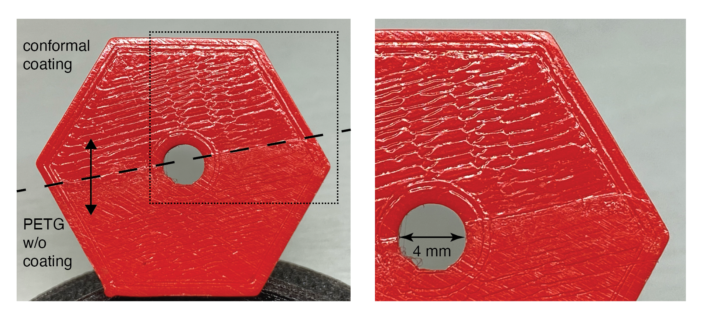

Once printed, the parts were coated with three spray coats and allowed to cure at room temperature (~ 20°C) for 24 hours between coatings. The components of the cooling system are shown in the image below.

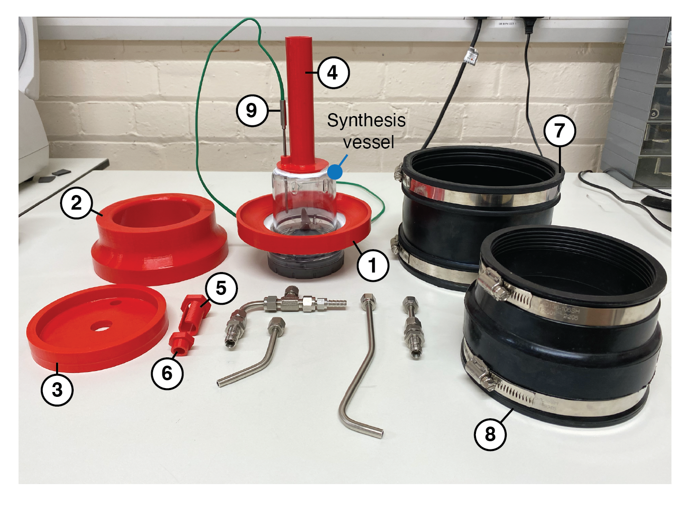

Components `1`, `4` and `9` were bonded to the synthesis vessel (Kenwood BLP31.D0WG) using a sealant adhesive. The spout with integrated thermocouple mounting (Component `4`), required modifications to the synthesis vessel before the bonding process. A 15 mm diameter hole was drilled at the top and centre of the vessel. This hole allows filling the vessel with precursor materials from the top (shown later). A second 4 mm diameter hole, located 20 mm from the centre of the vessel, was drilled to accomodate the insertion of a thermocouple probe for measuring the process temperature. The thermocouple probe is inserted into component `4` at the desired depth, and the part then bonded to the top of the vessel. 

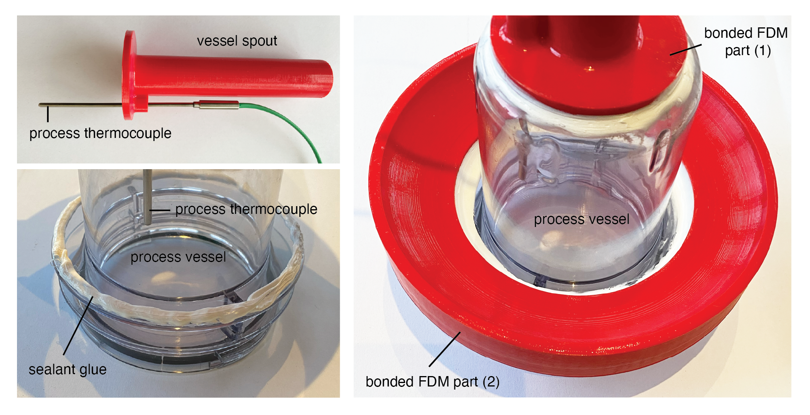

The complete assembly instructions are discussed in the following sections. The following image shows the barebone assembly of printed parts and synthesis vessel without the cooling jacket installed. The vessel spout was also designed to facilitate product sampling during material processing. Here, you can see a 10 mL pipette inserted into the vessel through the opening in the top part. Product samples can be taken without dissassembling the vessel, or interfering with the thermocouple or cooling system itself. The (optional) coolant recirculation pipes were formed using SS tubing and a pipe bender. These are intended to transport cooling fluid onto and away from the synthesis vessel, improving the convective heat transport from the external walls of the vessel.        

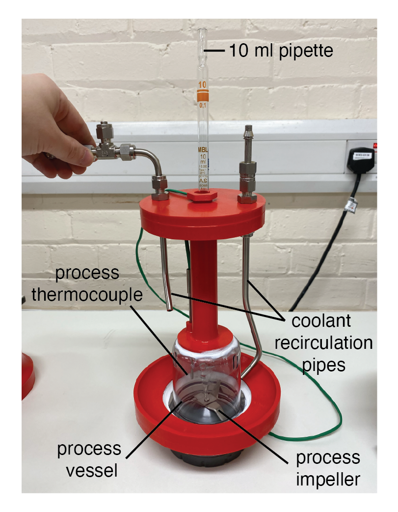

## Assembly of Liquid Exfoliation Cooling System 

### Steps 1-4: Cooling jacket assembly

1. Connect the lower cylinder to the base of the synthesis vessel. Tighten the lower hose clip to secure the EPDM pipe connector (component `7`) in place.
2. Insert the mid-section part (component `2` in the part breakdown shown above) and tighten the second hose clip.
3. Connect the upper cylinder to the mid-section (component `2`) and tighten the lower hose clip of this EPDM pipe connector (component `8`) to secure it.
4. Guide the thermocouple connector and cable (component `9`) through the central hole. Do not secure the top part in the EPDM pipe connector (component `8`) at this stage. If using an external pumped cooling loop, mount the coolant recirculation pipes and pipe connectors to the top part (component `3`). 

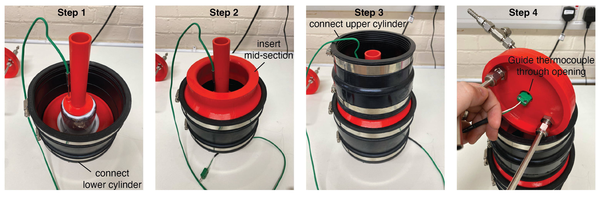

### Step 5: Precursor filling

5. Insert funnel into the top of the spout (component `4`) and load the precursor materials into the mixing vessel.

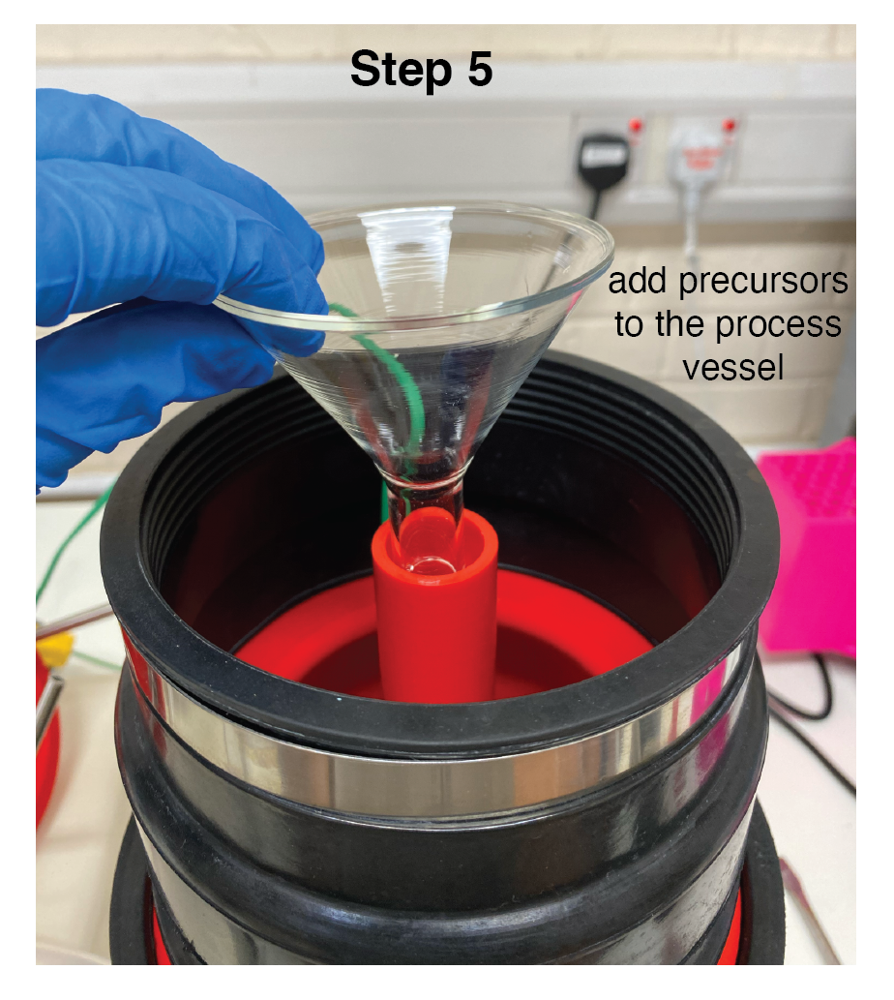

### Step 6: Ice filling

6. Pack the cooling jacket with ice cubes. Note, that the size of the ice cubes impacts how much can be added. If a maximum ice fill is required, the kitchen blender could also be used to break up large ice cubes into smaller pieces that can pack into the cooling jacket with lower void fraction. 

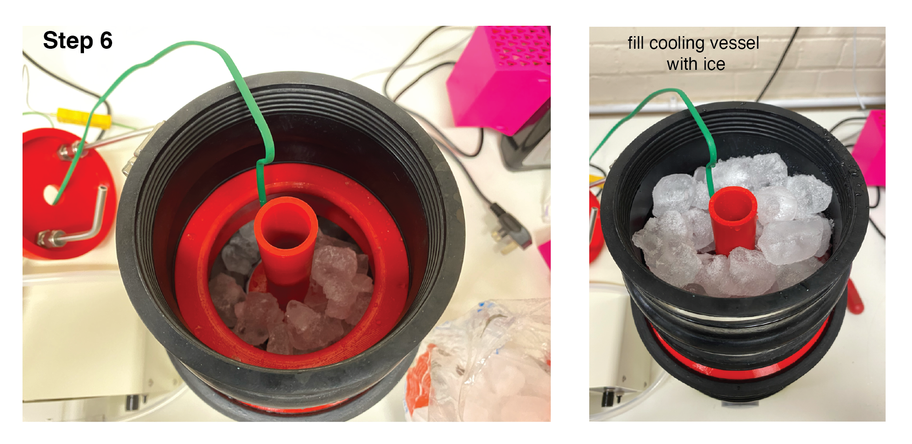

### Step 7: Cooling jacket closure

7. Insert the top section (component `3`) and tighten the second hose clip on the EPDM pipe connector (component `8`) to secure and seal the cooling jacket. If using an external pumped cooling loop, connection the pump tubes for coolant circulation.

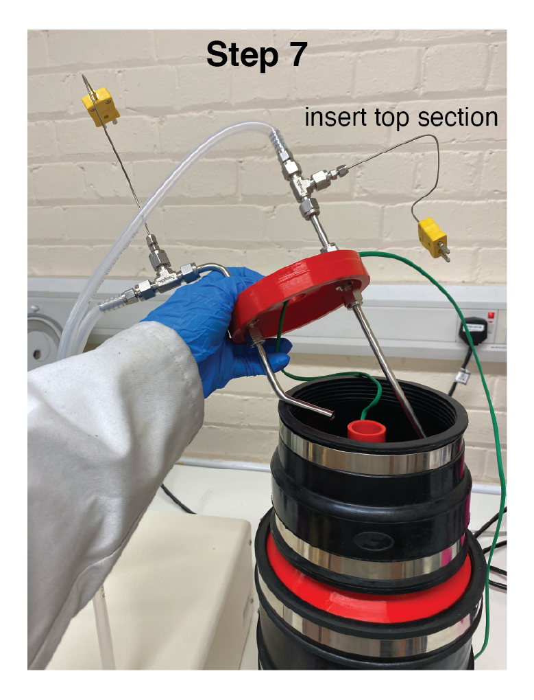

### Step 8-9: Thermocouple routing 

8. Fit the thermocouple port insert (component `5`) into the top section (component `3`), guiding the thermocouple cable through the slot. Push fully into place as shown in the images below. This component fits through the top section and into the vessel spout.
9. Insert the thermocouple port plug (component `6`) to close the opening to the vessel spout. 

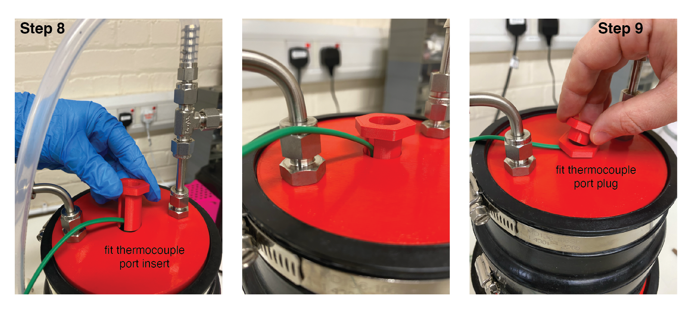

### Step 10: Connecting to thermocouple datalogger

10. Connect the process thermocouple to the data logger. If using an external pumped cooling loop, with additional coolant thermcouples on the inlet and outlet, connect these to the data logger also.

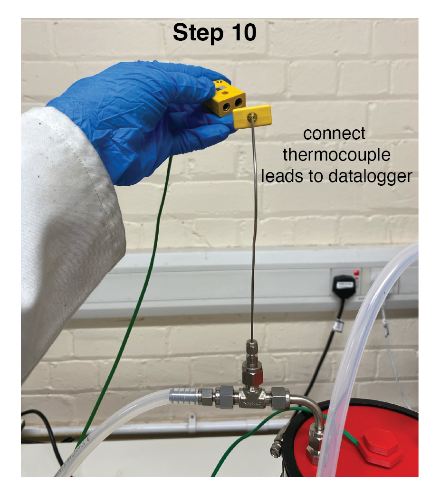

This completes the cooling system assembly for the liquid phase exfoliation (LPE) process.

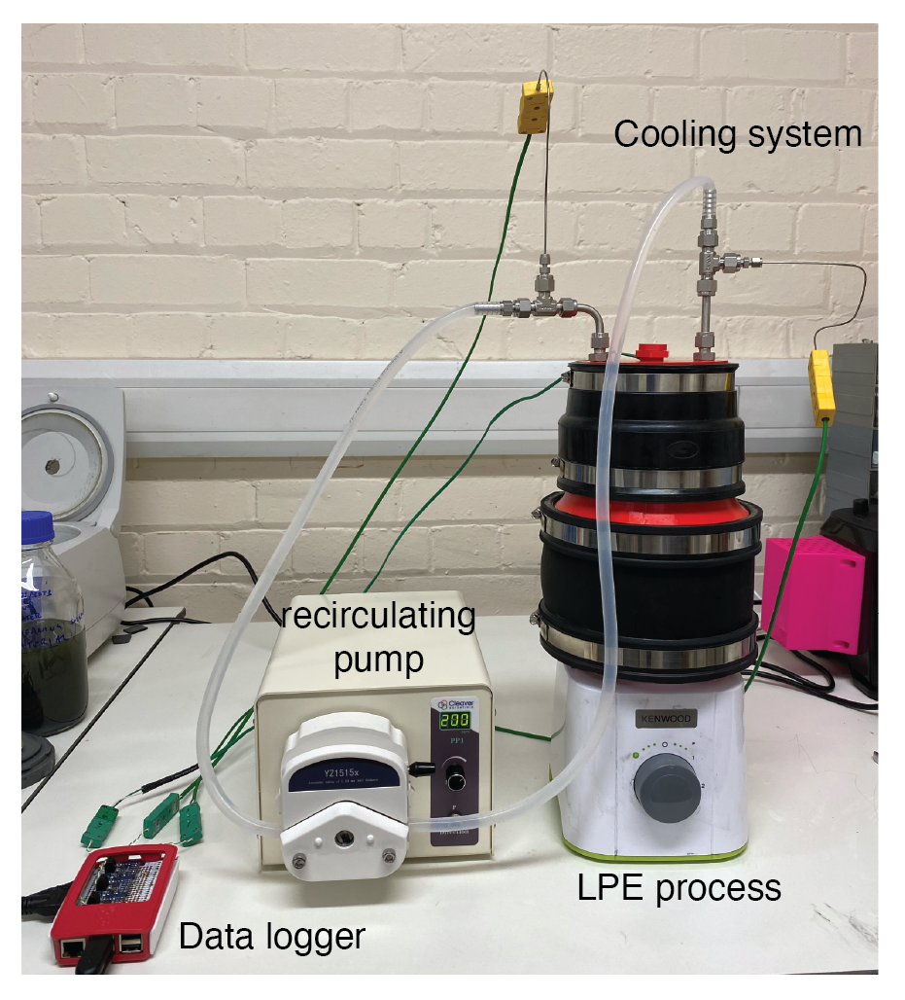


