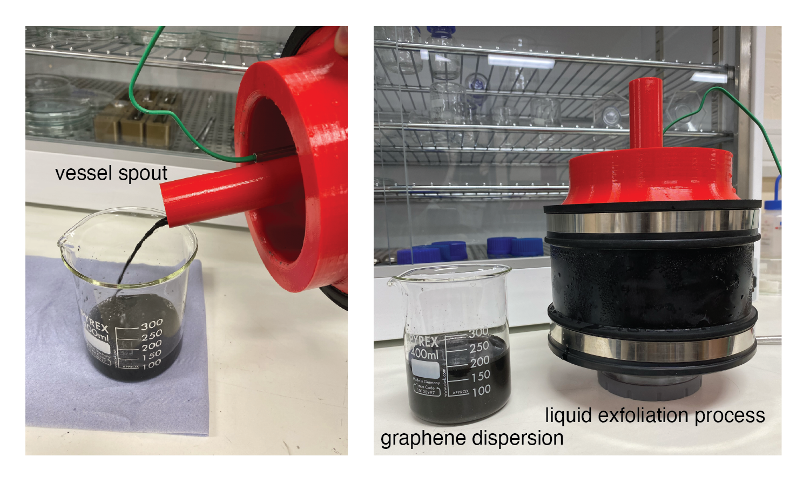

# Liquid Exfoliation Cooling System

_A low-cost approach for cooling high shear exfoliation and material blending processes. The main cooling apparatus is constructed from 3D-printed components and off-the-shelf pipe connectors. Included are the designs and build notes. Part of the Open Science Framework repository [Open2DM](https://osf.io/evupy/)._

## Background & Motivation

_This is part of the [Open2DM](https://osf.io/evupy/) labware project._

High shear exfoliation is a process that uses mechanical force to produce atomically thin materials in liquid dispersions. Our research explores and utilises these processes to synthesise materials such as graphene, graphene-based materials, and others including transition metal dichalcogenides. We decided to create a low-cost, controllable shear exfoliation system that would be capable of synthesising reasonable product concentrations and formulating functional inks/composites at laboratory scales (~ 100 mL volumes). The aim was to design and build a scientific instrument which would allow researchers to do this with a low entry cost (~ 200 GBP). 

Standard kitchen blenders have been shown to be capable of performing high shear exfoliation of two-dimensional materials ([doi:10.1039/C4NR03560G](https://doi.org/10.1039/C4NR03560G), [doi:10.1016/j.carbon.2014.07.035](https://doi.org/10.1016/j.carbon.2014.07.035). Recently, our group has extended this accessible technique to include _in situ_ spectroscopy [doi:10.1016/j.cherd.2021.10.041](https://doi.org/10.1016/j.cherd.2021.10.041) and up-cycling of electric vehicle battery anodes at end-of-life [doi:10.1021/acs.iecr.2c02634](https://doi.org/10.1021/acs.iecr.2c02634). High shear exfoliation processes tend to generate viscous heating which can increase product temperature significantly above ambient. For many applications and scientific investigations, it can be necessary to control these process temperatures (e.g., for chemical reactions or to avoid solvent evaporation).   

This repository provides the build details and CAD for creating a cooling system that can control the temperature of a liquid exfoliation process. These are designed around a high shear exfoliation process which utilises a controllable kitchen blender to impart a range of shear rates ($\dot{\gamma} \sim 10^2-10^5$ s $^{-1}$). We provide build details on how to modify and integrate programmable control of a kitchen blender elsewhere and accessible here: [XXXXXXXX - link to Diego's repo].  Some of the CAD files are designed for this specific blender vessel, however, the approach and configuration is extendable to any vessel and our CAD files and instructions can be used as templates to work from in these circumstances.

Below shows recovery of few-layer graphene in aqueous-surfactant dispersions (De-ionised water / Sodium Cholate) that were produced using this cooled high shear exfoliation device.

 

